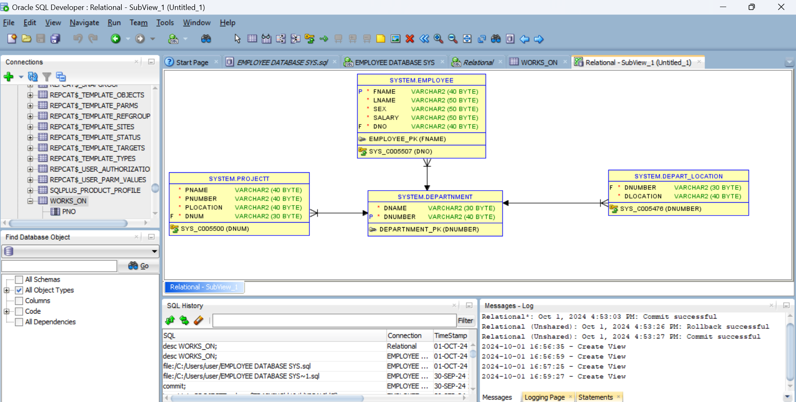

# EMPLOYEE DATABASE SYSTEM
.
This README provides an overview of the Employee Database system inorder to manage and store information related to employees with any organizational  structure. It includes tables for EMPLOYEES, DEPARTNMENT,  PROJECT , DEPART_LOCATION and WORKS_ON records which this company uses to manage their activity which happen in different area.

## Table Structures

### EMPLOYEES TABLE
```sql
create table EMPLOYEE(
Fname varchar (40) not null,
Lname varchar (50) not null,
sex varchar (50) not null,
salary varchar (50) not null,
Dno varchar (40) not null,
primary key (Fname),
foreign key (Dno) references DEPARTNMENT (Dnumber)
```
);

### DEPARTNMENT TABLE
```sql
create table DEPARTNMENT
( Dname varchar(30) not null,
Dnumber varchar (40) not null,
primary key (Dnumber)
```
);
### PROJECT TABLE
```sql
create table PROJECTT
( Pname varchar (40)not null,
pnumber varchar (40) not null,
plocation varchar (40) not null,
Dnum varchar (30) not null,
foreign key (Dnum) references DEPARTNMENT (Dnumber));
```

### DEPART_LOCATION TABLE
```sql
create table DEPART_LOCATION
( Dnumber varchar(30) not null,
Dlocation varchar (40) not null,
foreign key (Dnumber) references DEPARTNMENT (Dnumber));
```

### WORKS_ON TABLE
```sql
create table WORKS_ON
(Pno varchar (40) not null,
Pname varchar (40) not null
);
```

```sql
### SELECT  AND UPDATE
```

## Inserting records

To insert records into the tables, you can use the following examples:

### Insert EMPLOYEE  
```sql
insert into EMPLOYEE values ('ALINE','MUHOZA','F','150000','5');
insert into EMPLOYEE values ( 'CARINE','RUGWIRO','F','250000','4');
insert into EMPLOYEE values ( ' MOHAMMED','GAEL','M','100000','2');
```

### Insert DEPARTNMENT
```sql
insert into DEPARTNMENT values ('FINANCE','5');
insert into DEPARTNMENT values ('TRAINING','4');
insert into DEPARTNMENT  values ( 'ASSOCIATION','2');
```

### Insert PROJECT
```sql
insert into PROJECTT values ('TRAINING','101','KIGALI','5');
insert into PROJECTT values ('CREATIVE','201','KIMIRONKO','4');
insert into PROJECTT values ('BUDGETING','300','KICUKIRO','2');
```

### Insert DEPART_LOCATION
```sql
insert into DEPART_LOCATION values ('5','KIGALI');
insert into DEPART_LOCATION values ('4','KIMIRONKO');
insert into DEPART_LOCATION values ('2','KICUKIRO');
```
### Insert WORKS_ON
```sql
insert into WORKS_ON values ('101','TRAINING');
insert into WORKS_ON values ('2001','CREATIVE');
insert into WORKS_ON values ('300','BUDGETING');
```

```sql
SELECT LNAME FROM EMPLOYEE WHERE DNO=2;
SELECT FNAME FROM EMPLOYEE WHERE DNO=4;
UPDATE DEPARTNMENT SET DNAME='HUMAN RESOCERS' WHERE DNUMBER=4;
```
commit;

## Conceptual, Logical and Physical Data Model




## Conclusion
This Database shows how this company manages different Employees in different departnment with different project with each one should work_on this helps the company to manage their data well.


